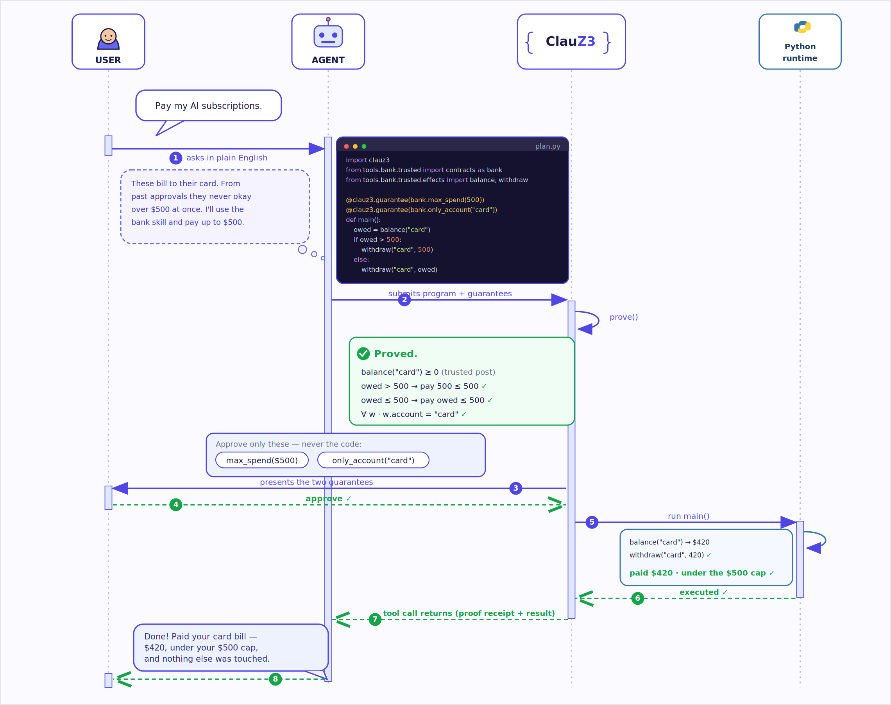

  
  

# ClauZ3

Static contracts for agent-authored Python.

ClauZ3 experiments with a different permission surface for agents: the agent
writes a small Python program, attaches a contract describing its trusted side
effects, and a static prover checks the contract before anything runs.

The contract is the thing the user should be asked to accept. The program is
still available for inspection, but a user should not have to read every branch
to answer questions like:

- Will this email anyone other than Bob?
- Will this email the same person twice?
- Will this withdraw more than $5 total?
- Will this write outside a sandbox?

## In one picture

A run, end to end: the user asks for a bill to be paid (capped); the agent
writes a program that looks up the outstanding balance and pays
`min(balance, $500)`; ClauZ3 proves the spend stays under the cap on *every*
branch and that only the named account is touched; the user approves the
*guarantees*, not the code; only then does the runtime execute it.

  

## How it fits together

Projects split into two layers:

- **Trusted roots** such as `tools/email/trusted/`: small audited modules
  containing side-effecting functions and reusable domain contracts. The prover
  trusts their signatures, `@deal.has(...)` markers, `@deal.pre(...)`
  preconditions, and `@contract` helper definitions.
- **Agent-authored code**: ordinary Python that imports trusted functions and
  adds `@clauz3.guarantee(...)` decorators to the function being proved.

Trusted calls bottom out into symbolic effect facts that domain contracts can
query as relations.

## Where to go next

- [Background and related work](explanation/background.md) — motivation
  and FORGE comparison.
- [Effect specs](reference/effect-specs.md) — the relation algebra over
  trusted-call facts and its current primitives.
- [Coverage policies](reference/coverage-policies.md) — how a trusted layer
  flags or enforces the guarantees an agent should make about a domain it
  uses.
- [ClauZ3 Python subset](reference/python-subset.md) — supported language
  for both agent code and contract lambdas.
- [Approval service](how-to/approval-service.md) — user-controlled approval
  boundary, startup, URL discovery, command-line arguments, and REST/UI
  routes.
- [Integration testing](how-to/integration-testing.md) — black-box recipe
  for `clauz3 run` against a localhost approval service.

For the full README with worked examples and the current status of the
prover, see the
[project README on GitHub](https://github.com/normalform-ai/clauz3#readme).

## Built on

  
  &nbsp;&nbsp;
  

ClauZ3 layers on two upstream projects and would not exist without them:

- **[deal](https://deal.readthedocs.io/)** — the Python runtime contract
  engine whose `@deal.pre`, `@deal.post`, and `@deal.has` decorators define
  the trusted-layer vocabulary. ClauZ3 reads the same decorators and
  discharges them statically; in runtime-only mode, deal enforces them at
  execution.
- **[Z3](https://github.com/Z3Prover/z3)** — Microsoft Research's SMT solver,
  the back-end the prover compiles every guarantee into. The vendored
  `deal-solver` machinery is what bridges Python AST and Z3 constraints.
